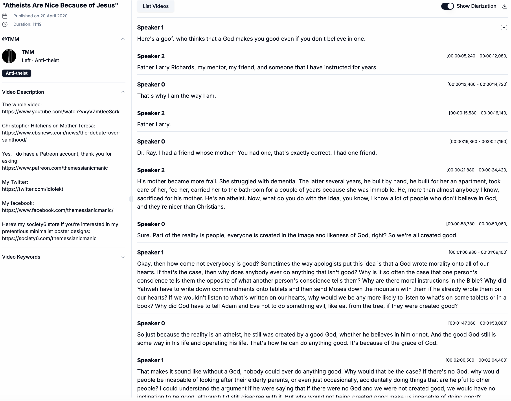

## Decoding YouTube Political Content: Understanding Topics in Different Ideologies

This research introduces a novel dataset of political YouTube video transcripts, categorized by political ideologies, addressing the need for scalable analysis of political content on the platform. Using advanced Automated Speech Recognition (ASR) technology—specifically **Whisper**—in conjunction with speaker diarization (SD) tools, the study evaluates the accuracy of transcript generation in the context of political content. These tools were applied to generate over **10,000 transcripts** focused on COVID-19-related content. 

To enable researchers to easily explore YouTube political content across ideological groups, we developed a web app that provides easy access to this dataset. Preliminary experiments using **TopicGPT** for topic modeling revealed key themes and shifts in discourse during major events like COVID-19.

---

### Research Components

This research is divided into four major components:

### 1. Scraping: **yt-video-scraper**
In this phase, we scraped metadata from **3 million** political YouTube videos and selected around **10,000** COVID-19 case study videos for further analysis.

- **Download**: [3,393,874 YouTube political metadata](https://drive.google.com/drive/u/0/folders/11XkzCTerbk3651zyY_K6DHBNsGtB266B)

### 2. Transcribing: **yt-video-transcriber**
This phase focuses on evaluating ASR and SD models and generating transcripts from the selected COVID-19 case study dataset.

- **Download**:
  - [Before COVID-19 (Feb 1, 2019 – Jan 31, 2020)](https://drive.google.com/drive/u/0/folders/1HB2Hnkmsahl0xg2gXWeFPQy3Yac2rJJB): 5,714 video transcripts + metadata
  - [After COVID-19 (Feb 1, 2020 – Jan 31, 2021)](https://drive.google.com/drive/u/0/folders/1HB2Hnkmsahl0xg2gXWeFPQy3Yac2rJJB): 5,726 video transcripts + metadata

### 3. Analyzing: **yt-video-analyser**
In this phase, we conducted preliminary experiments to analyze the topics discussed by different political ideologies before and after the COVID-19 outbreak using **topic modeling**.

- **Topic Example - Health** (Partisan Right):

  **Before COVID-19**:
  > The discussion revolves around various health-related topics, including the importance of being comfortable in the water, the development of a fetus, and the physical and mental health problems associated with different factors such as diet, screen time, and medical procedures. The topics also encompass healthcare systems, including Medicare for All and the Affordable Care Act, as well as the impact of laws on vaccination requirements and health insurance. Additionally, the discussion touches on the physical and emotional trauma experienced by individuals, including Holocaust victims and those who have undergone medical transition, and the potential long-term health risks associated with certain medical procedures. Overall, the conversation is centered around the complexities of human health and the various factors that influence it.

  **After COVID-19**:
  > The discussion revolves around the COVID-19 pandemic, its health implications, and the various measures taken to combat it. The conversation touches on topics such as vaccine development, healthcare plans, and the impact of the pandemic on different countries, including the US, China, and Italy. It also mentions the importance of public health, social distancing, and the need for access to healthcare, particularly for vulnerable populations like refugees and the elderly. Additionally, the discussion highlights the economic and social consequences of the pandemic, including the impact on small businesses, mental health, and the homeless crisis. Overall, the conversation emphasizes the need for a comprehensive approach to address the pandemic, including scientific research, public health measures, and social support.

### Showcasing: **yt-video-webapp**
To facilitate easy dissemination and provide a more readable version of the transcripts, the dataset is available in multiple file formats. Users can search for political videos they are interested in and download them directly from the app.

---